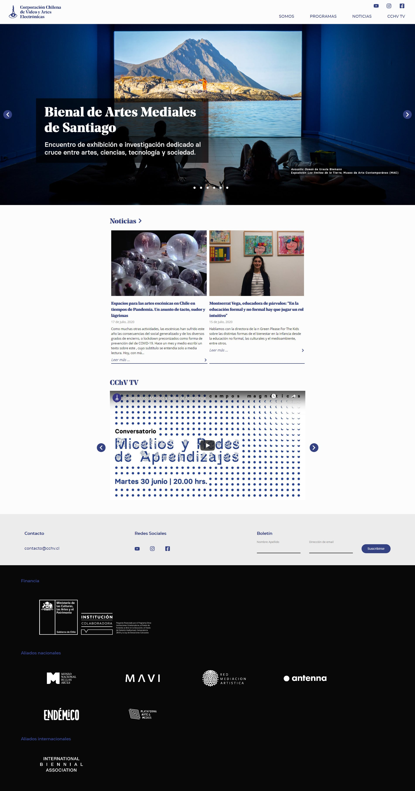

# web-cchv

Web Corporacion Chilena de Video: https://www.cchv.cl

Based on [VUE CLI](https://cli.vuejs.org)



## Project setup

```
npm install
```

### Compiles and hot-reloads for development

To start the development server use:

```
npm run serve
```

Environment variables can be defined on a `.env` file to enable specific features:

```
VUE_APP_BASE_URL // Base url used to query the API
VUE_APP_ENABLE_MOCKS // Whether if mock API data or not. Enables access to the app without the need of a real backend.
VUE_APP_GOOGLE_ANALYTICS // Google analytics tracking id
```

### Compiles and minifies for production

```
npm run build
```

## TODO

- add i18n, organize string labels
- filter activities by type on activities page
